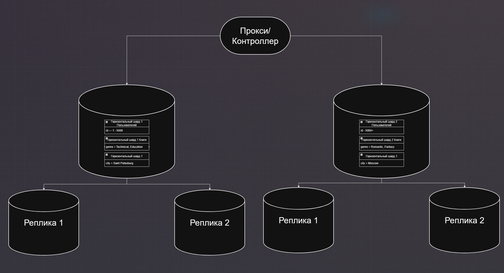

Задание 1
Опишите основные преимущества использования масштабирования методами:

1. активный master-сервер и пассивный репликационный slave-сервер;
Плюсы:
В случае отказа мастера, мастера подхватит slave и все будет работать
У клиента никогда не будет устаревших данных, ведь все читается и пишется в мастер
Высокая латентность для географически распределенных клиентов, так как все запросы идут в один master
Минусы:
Мастер будет всегда нагружен из за того что и чтение и запись идут на него
Время на перенос мастера при падении мастера

2. master-сервер и несколько slave-серверов;
Плюсы:
Хорошая доступность и отказаустойчивость если они гео-распределены
Хороший баланс нагрузки
Минусы:
Плохая консистентность данных из за задержек репликации 
Дайте ответ в свободной форме.

Задание 2
Разработайте план для выполнения горизонтального и вертикального шаринга базы данных. База данных состоит из трёх таблиц:

пользователи,
книги,
магазины (столбцы произвольно).
Опишите принципы построения системы и их разграничение или разбивку между базами данных.

Пришлите блоксхему, где и что будет располагаться. Опишите, в каких режимах будут работать сервера.

Дополнительные задания (со звёздочкой*)
Эти задания дополнительные, то есть не обязательные к выполнению, и никак не повлияют на получение вами зачёта по этому домашнему заданию. Вы можете их выполнить, если хотите глубже шире разобраться в материале.

Задание 3*
Выполните настройку выбранных методов шардинга из задания 2.

Пришлите конфиг Docker и SQL скрипт с командами для базы данных.